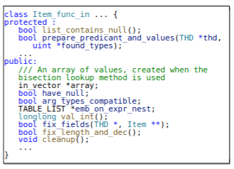

## **CASE STUDY**
LEGO found lots of bugs that are common in real-world queries. Here is an case study of UAF in MYSQL, which gets an CVE ID. 

### **CVE-XXXX-21303: A Use-After-Free Bug in MySQL**
The bug is hidden deeply in the *item_cmpfunc.cc* of MySQL. It triggered a use-after-free issue in class *Item_func_in*, which caused serious security damage to the database. Figure 1 shows a part of code for the class *Item_func_in* which is designed for IN expression. The *in_vector \*array* is the main member to store the temporary data of an expression. It also contains some other functions and variables for different operations. For example, the *cleanup()* is used to free the array.

<center>
    
    <br>
    <div>Figure 1</div>
</center>

### **The mechanism to trigger the bug.** 
Listing 1 shows the SQL query that triggers that bug. First, it creates a table *v0* and associates attribute *v3* with v1by using the *GENERATED* clause and *IN* expression. In the process, the *in_vector \*array* in *Item_func_in* would be used to store the temporary data in the associated column. 
Then it executes the ALTER statement and the INSERT statement to change the structure of the table and insert the record into the table *v0*. However, the *cleanup()* function is called by mistake and the *in_vector \*array* is freed, which may still be used when operating the table *v0*.  Finally, a use-after-free happens when MySQL executes the SELECT statement to query data from *v0*. 

```SQL
CREATE TEMPORARY TABLE v0 ( v1 TINYBLOB, v2 TINYINT, v3  BINARY GENERATED ALWAYS AS (v1 IN (FALSE, CURRENT_USER() IS NULL,34))) ;
ALTER TABLE v0 ADD COLUMN v0 MEDIUMINT;
INSERT IGNORE INTO v0 VALUES ('x','x','x',1);
SELECT * FROM v0;
```
<center>Listing 1</center>

### **The damage of the bug.** 
It is a high-severity UAF vulnerability, which could cause serious database security problems. When the SELECT statement is executed to query the data in the table, the array variable is previously freed, but it will be used again because the array internal function could still be called for related operations. If an attacker occupies the array object in advance through operations such as heap spray, the attacker may directly control the entire execution process and take the opportunity to obtain sensitive information of other users in the database, causing serious security damage.
According to the *Oracle Security Alerts* analysis, the bugs can be used to directly attack the MySQL server by network with low complexity. Even without user interaction, it could also cause a high availability impact on MySQL server by an attacker.  