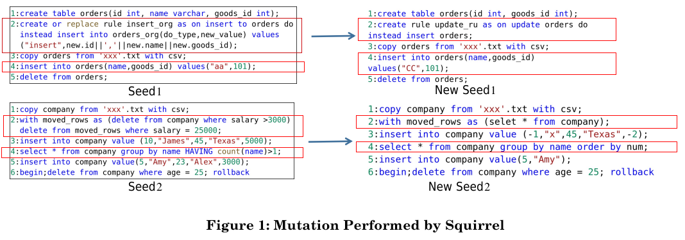
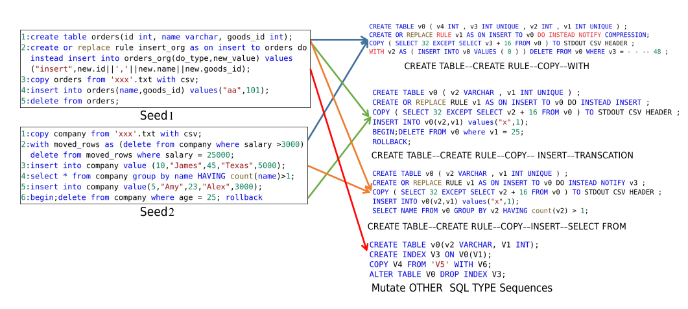

## **Details of Generating SQL queries**
Figure 1 and Figure 2 show the mutation process from two same initial seeds (i.e. Seed1 and Seed2) performed by Squirrel and LEGO, respectively. 
Squirrel only changes the structure and data of individual SQL statements. As Figure 1 illustrates, for Seed1, it changes the 2nd statement and 4th statement rather than their types. As a result, Seed 1 and the mutated New Seed1 both have the same SQL Type Sequence *CREATE TABLE→ CREATE OR INSERT RULE→ COPY→ INSERT→ DELETE*. The process is the same for Seed2 and New Seed2.
LEGO is able to combine different types of SQL statements to generate abundant and meaningful SQL Type Sequences. As Figure 2 illustrates, it first learns the pattern of composing SQL statements (i.e. type-affinity) from existing seeds. Then it recombines these statements based on the type-affinities to synthesize new SQL Type Sequences. Consequently, three new SQL TYpe Sequences (i.e. *CREATE TABLE-->CREATE OR INSERT RULE-->COPY-->WITH*, *CREATE TABLE-->CREATE OR INSERT RULE-->COPY-->INSERT-->TRANSACTION*, *CREATE TABLE-->CREATE OR INSERT RULE-->COPY-->INSERT-->SELECT*) are generated. The seeds with different SQL Type Sequences can be continuously generated, which help improve the branch coverage and to trigger hidden vulnerabilities.

    
     
    
Figure 1:Mutation Performed by Squirrel

    
     
    
Figure 2:Mutation Perfromed by LEGO

